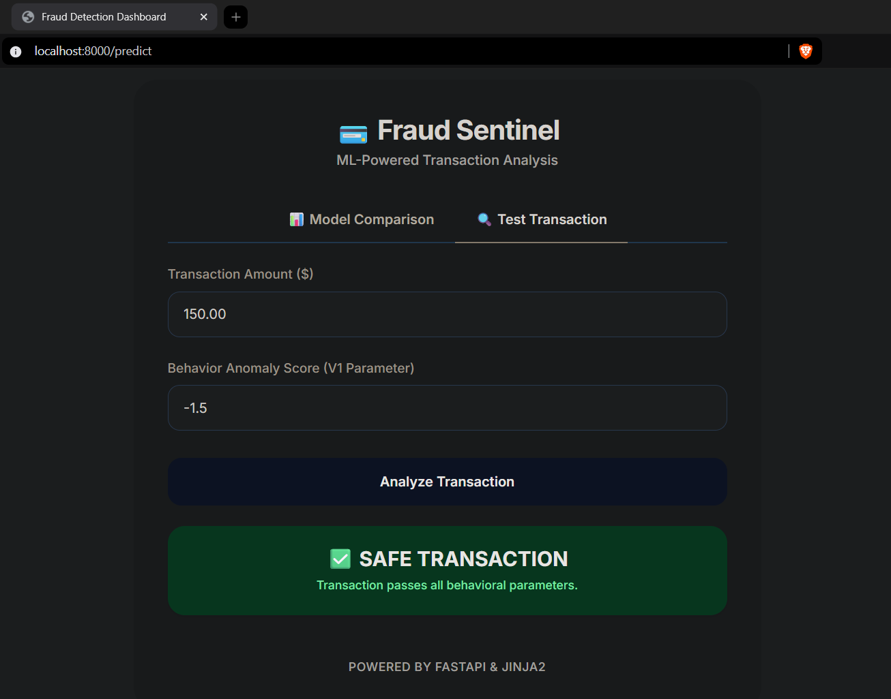
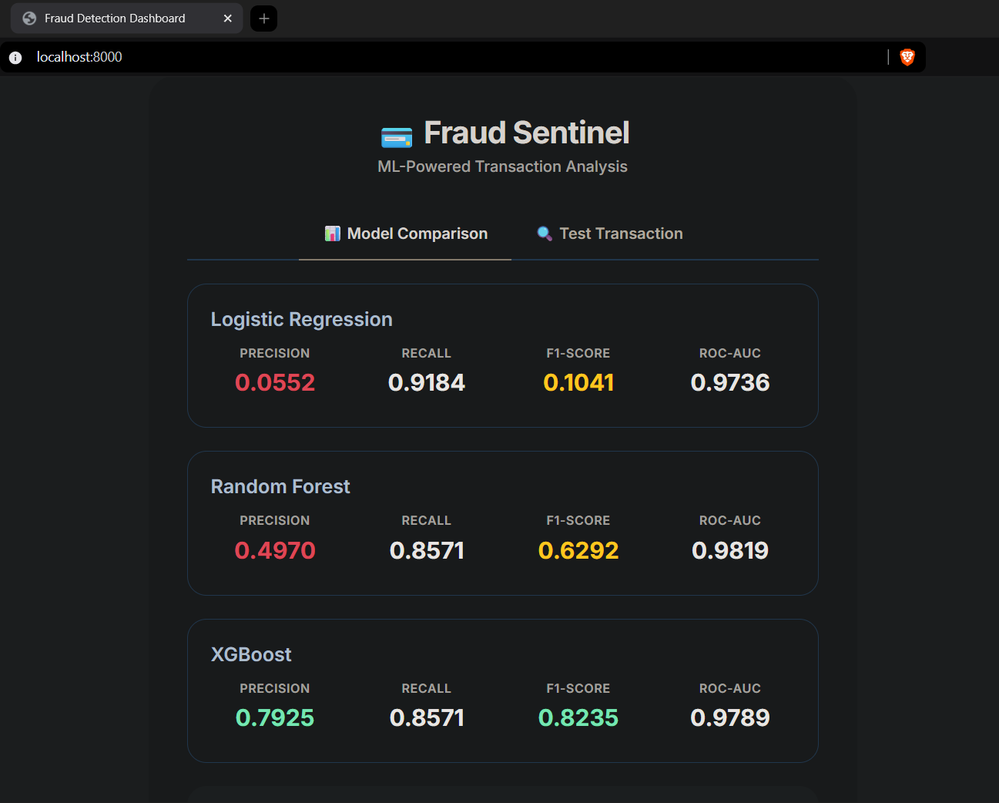

# Credit Card Fraud Detection System

A machine learning project that trains multiple models to detect fraudulent credit card transactions, compares model quality metrics, and serves a FastAPI dashboard for interactive prediction.

## Screenshots

### Dashboard Preview

### Prediction Result Preview

## Features

- End-to-end training pipeline from data loading to model export
- Data preprocessing and feature engineering for fraud signals
- Class imbalance handling with SMOTE
- Model comparison across Logistic Regression, Random Forest, and XGBoost
- Evaluation with Precision, Recall, F1-Score, and ROC-AUC
- FastAPI + Jinja2 dashboard to view metrics and test sample transactions

## Project Structure

- app.py: FastAPI application and dashboard routes
- main.py: training and evaluation pipeline entry point
- requirements.txt: Python dependencies
- data/creditcard.csv: training dataset (real or generated fallback)
- models/metrics.json: saved evaluation metrics
- models/best_model.pkl: best model artifact generated after training
- src/preprocess.py: data cleaning and scaling
- src/features.py: feature engineering and SMOTE balancing
- src/train.py: model training and model saving
- src/evaluate.py: model evaluation utilities
- templates/dashboard.html: dashboard UI template

## Tech Stack

- Python
- pandas, numpy
- scikit-learn
- xgboost
- imbalanced-learn
- fastapi, uvicorn
- jinja2

## Setup

1. Clone the repository.
2. Create and activate a virtual environment.
3. Install dependencies:

   pip install -r requirements.txt

## Run Training Pipeline

Run the training pipeline to preprocess data, train models, evaluate metrics, and save artifacts:

python main.py

What this generates:
- models/metrics.json
- models/best_model.pkl

Note:
- If data/creditcard.csv is missing, the project auto-generates a small dummy dataset so the pipeline can still run.

## Run Dashboard API

Start the FastAPI app:

python app.py

Then open:
- http://localhost:8000

Dashboard capabilities:
- View model comparison metrics
- Submit transaction Amount and V1 score for prediction

## API Endpoints

- GET / : Render dashboard page
- POST /predict : Run prediction from submitted form data

## Evaluation Focus

This project prioritizes fraud-relevant metrics over plain accuracy:
- Precision: How many predicted frauds are truly fraud
- Recall: How many real frauds are detected
- F1-Score: Balance between precision and recall
- ROC-AUC: Ranking quality across thresholds